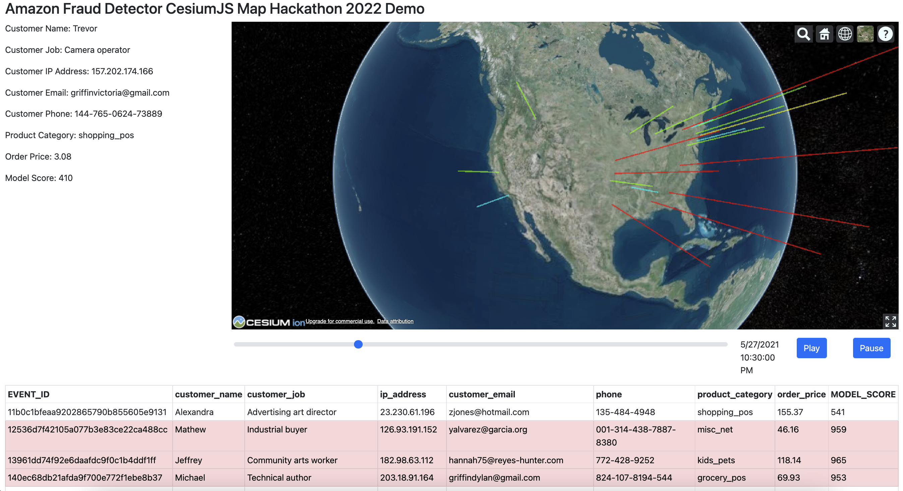

# Fraud Map

## About
This application was developed for the 2022 AWS AI/ML Hackathon. It serves as a proof-of-concept for an interactive tool that allows
Amazon Fraud Detector customers to visualize and analyze fraud predictions in a geographic and chronological context.

## Quick Start Guide
0. Clone this repo
1. Get your cesium token by making an account using the steps at https://cesium.com/learn/cesiumjs-learn/cesiumjs-quickstart/#step-1-create-an-account-and-get-a-token
2. Create a `.env` at the root with `CESIUM_TOKEN=...`, substituting with your cesium token
3. run `npm install`
4. run `npm run start` to start a local server